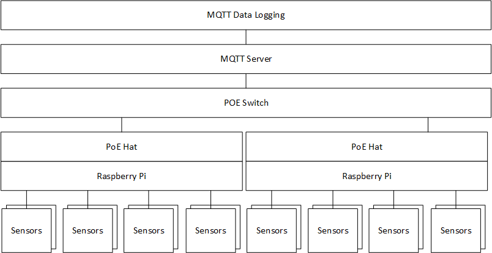

# Hive Pi

## Purpose

Hive Pi is a Raspberry Pi data logging platform designed for the [Ecdysis](<https://www.ecdysis.bio/>) Foundation. It uses MQTT to log different characteristics about each hive.

## Overview

Hive Pi is an MQTT based data logger. Raspberry Pi's powered from PoE hats serve as the main DAQ modules.



* One Raspberry Pi is used per pallet. 
* Multiple sensors per hive.
* Multiple Pi's per POE Switch.
* One MQTT Broker (Server) 
* One MQTT Data logger and dashboard

## Raspberry Pi Details

The Raspberry Pi's run a python service to collect and submit data to the MQTT server.  It's powered via a PoE shield. This route was chosen so we would not have to worry about servicing batteries or cold weather battery operation problems.

### Sensors

Currently the following sensors are being evaluated:

* Weight - Load Cells in four corners of the hive.
* Temperature - Part of the DHT11 sensor.
* Humidity - Part of the DHT11 sensor.
* Audio - Microphone placed in each hive. Likely only FFT data will be analyzed.

### Wiring & Hardware

Detailed software and hardware wiring can be found in hardware directory.

### Software

The raspberry-pi runs three seperate services for recording data, one for each type of sensor.

The services need to be enabled by:

```
sudo systemctl enable audio-py.service
sudo systemctl enable dht11-py.service
sudo systemctl enable hx711-py.service
```

#### Installation

The Raspberry Pi can be configured in one of two methods:

A. Manual install

B. Clone an existing install

##### A. Manual install

1. **Burn raspian to an SD card.** To manually install, first burn a copy of raspian to an SD card. There are many tutorials on this.
2. **Boot the image.** Install the SD card into the Raspberry Pi, and boot the Pi. You will need a keyboard, mouse, and monitor connected to the Pi.
3. **Clone this repo.** Use GIT to clone the repo to /home/pi/ws . There are many tutorials on cloning a repo.
4. **Install.** Install the raspberry pi software by copying the contents of 'raspberry-pi' to /home/pi/ws Then copy the three service files to '/lib/systemd/system/'
5. **Enable**. Enable the software to start on boot. Run the following commands at a terminal.

```
sudo systemctl enable audio-py.service
sudo systemctl enable dht11-py.service
sudo systemctl enable hx711-py.service
```

##### B. Manual Install

1. **Clone.** Clone an existing install by using a linux device to dd one card onto another.

### Pallet Configuration [ IMPORTANT ]

Rather than tracking the SN of each Pi, we simply have an enviroment file in the /home/pi/ws directory of the Raspberry pi. The **enviroment.conf** file contains a line called "**PALLET_NUMBER**" this needs to be set on each device.


## MQTT Server Details

The mqtt server will run the MTIG stack on a Linux system.

* **Mosquitto** MQTT server
* **InfluxDB**  Time series database
* **Telegraf**  Plugin for influxDB to collect MQTT data.
* **Grafana** Data visualization dashboard.

The Linux stack is run in a docker-compose container for quick setup.

#### Installation

These instructions are specific to a LINUX computer.

1. **Clone this repo.** Use GIT to clone this repo.

2. **Install docker-compose.** Install docker and docker-compose onto the computer.

3. **Install the service.** Copy the .service files to '/lib/systemd/system/'

4. **Start the service.** Enable and start the service by running the following command from a terminal:

   ```
   sudo systemctl enable honeypi.service
   sudo systemctl start honeypi.service
   ```


# How To Use

After setting up a server and running it as a service, use the following to access data:

1. **Grafana** --> Go to the following link: http://honey-pi.local:1111

   Grafana is used to plot all the data (except audio) for each hive. It has many powerful features.

2. **Jupyter Notebook** --> Go to the following link: http://honey-pi.local:/1111

   Jupyter notebook is a scientific notebook that has access to all the data. It can be used to visualize and analyze any data that has been logged. 

These pages can be accessed by any computer on the local network. Some windows computers may have problems with name resolution. If so, substitute the honey-pi.local with the IP of the server. 


